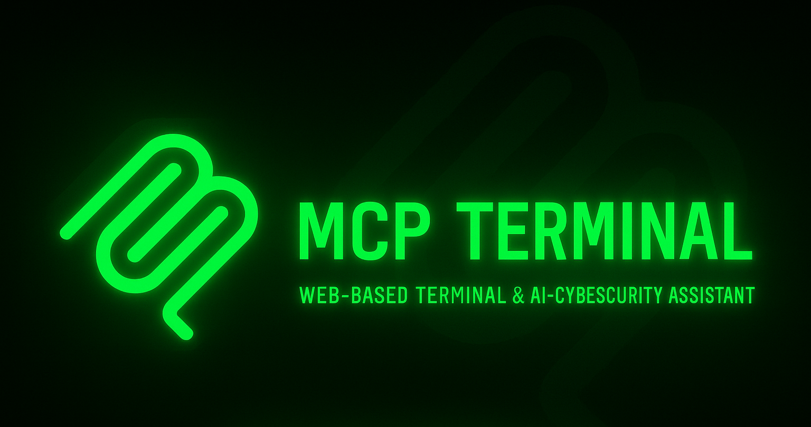

# MCP AI Remote Terminal with Full System Control

<p align="center">
  

# 🔥 Project Title

## 🚀 Overview
A mobile-controlled secure remote terminal for Kali Linux with built-in Gemini AI assistant and **full filesystem access**. Unlike basic remote tools, this provides AI-powered command suggestions, automatic script generation, and cybersecurity tool execution with persistent session management.

## ✨ Features
- **Dual-panel Interface**: Terminal + AI Chatbot
- **Full System Navigation**: Navigate anywhere in your file system with persistent `cd` support
- **Session Management**: Maintains working directory state between commands
- **AI Assistant**: Google Gemini integration for command suggestions and help
- **Cyberpunk UI**: Responsive, neon-glow design optimized for mobile
- **Tool Automation**: Quick access to Nmap, Hydra, Nikto, Metasploit, and more
- **Real-time Prompt**: Shows current directory like a real terminal

## 🏗️ Architecture
```
┌─────────────────┐      ┌──────────────────┐      ┌─────────────────┐
│   Mobile/Web    │─────▶│   MCP Server     │─────▶│  Kali Server    │
│   Browser       │      │   (port 5070)    │      │  (port 5090)    │
│                 │      │  - UI Serving    │      │  - Command      │
│  - Terminal UI  │      │  - AI Chat       │      │    Execution    │
│  - AI Chat      │      │  - Session Mgmt  │      │  - Tool APIs    │
│  - Tools Menu   │      │                  │      │  - State Mgmt   │
└─────────────────┘      └──────────────────┘      └─────────────────┘
```

## 🔧 Installation

### 1. Install Dependencies
```bash
pip install -r requirements.txt
```
Or use a virtual environment (recommended on Kali):
```bash
python3 -m venv myenv
source myenv/bin/activate
pip install -r requirements.txt
```

### 2. Configure AI (Optional)
Export your Google Gemini API key for AI features:
```bash
export GEMINI_API_KEY='your_api_key_here'
```
Or edit `server.py` and set `GEMINI_API_KEY` directly.

### 3. Run the Servers
**Easy way** - Use the startup script:
```bash
./start.sh
```

**Manual way** - Start both servers separately:
```bash
# Terminal 1: Start Kali backend server
python3 kali-server.py

# Terminal 2: Start MCP frontend server  
python3 server.py
```

### 4. Access the Terminal
Open your browser and navigate to:
- **Local**: `http://127.0.0.1:5070`
- **Mobile** (same network): `http://<your-kali-ip>:5070`

## 📱 Usage

### Terminal Commands
Type any Linux command just like a real terminal:
```bash
ls
cd /etc
pwd
cat /etc/hosts
cd ~/Desktop
```

The terminal now maintains your current directory across commands!

### AI Chat
Ask questions like:
- "How do I scan for open ports?"
- "Explain this nmap output"
- "What's the difference between -sV and -sS in nmap?"
- "How to find CPU usage?"

### Quick Tools
Click the **Tools** button (🛠️) to quickly launch:
- **Nmap**: Network scanning
- **Hydra**: Password brute-forcing
- **Wireshark/tshark**: Packet capture
- **Nikto**: Web vulnerability scanning
- **Metasploit**: Penetration testing framework
- 

### 🚀  demo screenshort ui 
 


## 🔐 Security Notes

⚠️ **IMPORTANT**: This tool allows remote command execution with full system access.

- Use ONLY on trusted local networks
- Do NOT expose to the internet without proper authentication
- Tools like Hydra & Nmap should only be used on authorized systems
- This is for educational and ethical hacking purposes only

## 📂 Project Structure
```
kali-mcp/
├── server.py           # Main MCP server (UI + AI)
├── kali-server.py      # Backend execution server
├── requirements.txt    # Python dependencies
├── start.sh           # Convenience startup script
├── static/            # Frontend files
│   ├── index.html     # Main UI
│   ├── style.css      # Cyberpunk styling
│   └── script.js      # Frontend logic
└── INSTRUCTIONS.md    # Usage instructions
```

## 🛠️ Technical Details

### Session Management
Each browser session gets a unique ID that tracks:
- Current working directory
- Command history
- Session state

### Command Execution Flow
1. User types command in browser
2. Frontend sends to MCP server with session ID
3. MCP server forwards to Kali backend
4. Backend executes in session's current directory
5. Results + new directory returned to frontend
6. UI updates prompt and displays output

### Special Handling
- `cd` commands update session directory without executing in shell
- Relative paths resolved based on current directory
- Absolute paths work from anywhere
- `cd ~` and `cd` both return to home directory

## 🚦 Troubleshooting

**Commands not working?**
- Ensure both servers are running
- Check kali-server is on port 5090
- Check server is on port 5070

**Can't navigate directories?**
- Update to latest version (includes session management)
- Each browser tab has its own session

**AI not responding?**
- Verify GEMINI_API_KEY is set
- Check your API key is valid
- Ensure you have internet connection

## 🔮 Future Enhancements
- Voice-driven terminal control
- SSH transport layer
- Multi-user support with authentication
- Command output streaming
- File upload/download
- Visual file browser

## 📜 License & Copyright

**Copyright © 2025 Pugazhenthi**

This project is licensed for educational and ethical hacking purposes only.

### Author
**Pugazhenthi**  
LinkedIn: [linkedin.com/in/pugazh28](https://www.linkedin.com/in/pugazh28)

### Usage Terms
- Educational purposes only
- Use responsibly and ethically
- Only on authorized systems and networks
- Not for malicious activities

---

**Built with** ❤️ **by Pugazhenthi for the cybersecurity community**
